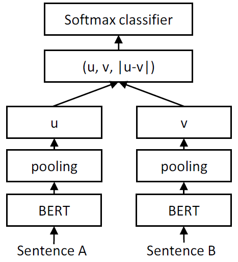
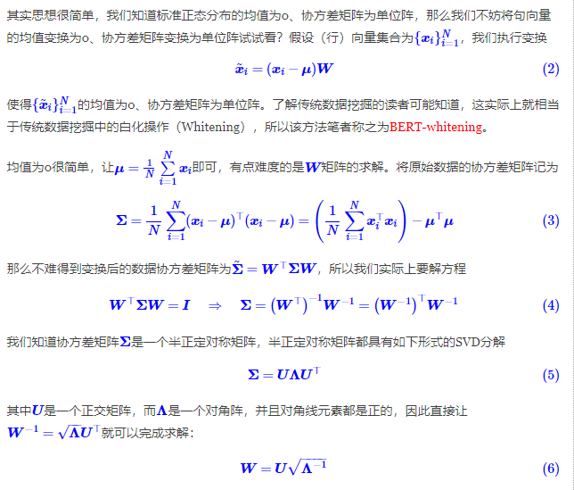

# Sentence pair similarity

## 1. 数据示例
| query1                   | query2                         | label |
| ------------------------ | ------------------------------ | ----- |
| 剧烈运动后咯血,是怎么了? | 剧烈运动后咯血是什么原因？     | 1     |
| 剧烈运动后咯血,是怎么了? | 剧烈运动后为什么会咯血？       | 1     |
| 剧烈运动后咯血,是怎么了? | 剧烈运动后咯血，应该怎么处理？ | 0     |
| 剧烈运动后咯血,是怎么了? | 剧烈运动后咯血，需要就医吗？   | 0     |
| 剧烈运动后咯血,是怎么了? | 剧烈运动后咯血，是否很严重？   | 0     |

## 2. 模型
### 1. Sentence Bert

SBERT在BERT/RoBERTa的输出结果上增加了一个Pooling操作，从而生成一个固定维度的句子Embedding。实验中采取了三种Pooling策略做对比：

- CLS：直接用CLS位置的输出向量作为整个句子向量

- MEAN：计算所有Token输出向量的平均值作为整个句子向量

- MAX：取出所有Token输出向量各个维度的最大值作为整个句子向量

### 2. Siamese Network

同样采取以上三种Pooling策略，loss function 采用 COSINEEMBEDDINGLOSS。我们真正要做的是一个特征提取模型（编码器），而最后使用的方法是对特征提取模型的特征进行对比排序。

### 3. Margin Softmax

同样采取以上三种Pooling策略，将训练集划分为很多组“同义句”，然后有多少组就有多少类，也将句子相似度问题当作分类问题来做。我们真正要做的是一个特征提取模型（编码器），而最后使用的方法是对特征提取模型的特征进行对比排序。
同时加强一下分类条件，就可以提升排序效果了，比如改为：每个样本与它所属类的距离，必须小于它跟其他类的距离的 1/2。

### 4. Bert whitening

Bert-whitening是直接对Bert生成的句向量做转换，将当前坐标系变换到标准正交基下，进而实现句向量空间的各向同性。

背景：

降维问题的优化目标：将一组N维向量降为K维（K大于0，小于N），其目标是选择K个单位（模为1）正交基，使得原始数据变换到这组基上后，各字段两两间协方差为0，而字段的方差则尽可能大（在正交的约束下，取最大的K个方差）。

参考：

- https://kexue.fm/archives/8069
- https://blog.csdn.net/u010376788/article/details/46957957
