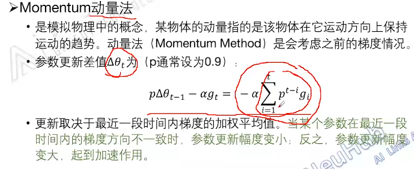
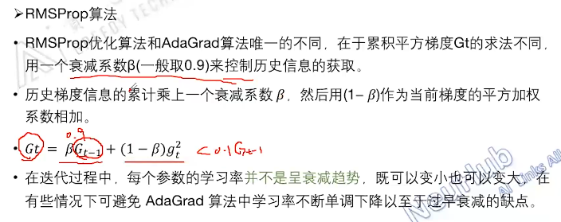
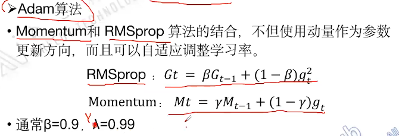
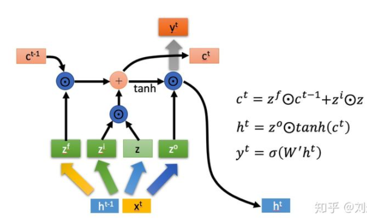
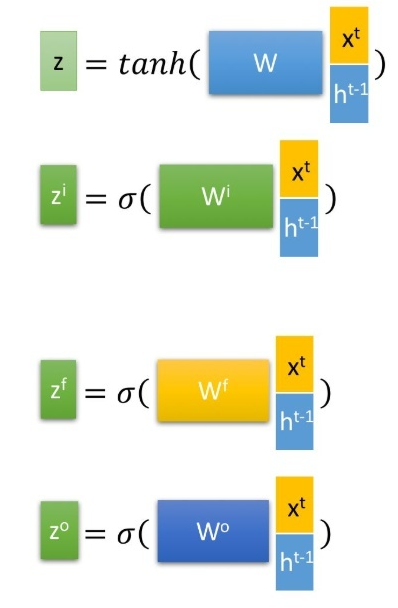
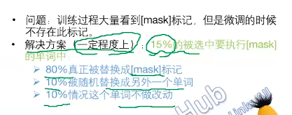
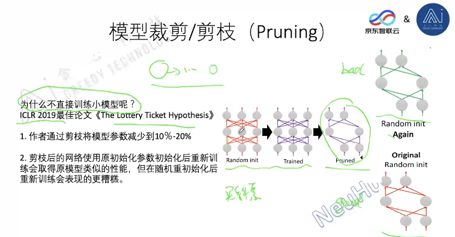
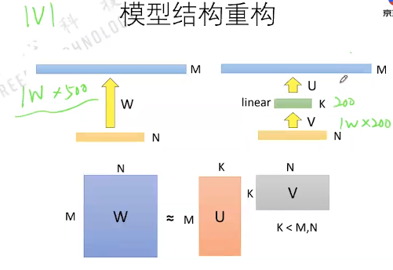

# 1. 机器学习评价指标

(1).准确率(Accuracy): 预测正确的结果占总样本的百分比, acc=(TP+TN)/(TP+TN+FP+FN)

(2).精确率(Precision): 在所有被预测为正的样本中实际为正的样本的概率, TP/(TP+FP)

(3).召回率(Recall): 在实际为正的样本中被预测为正样本的概率, TP/(TP+FN)

(4).[P-R曲线](https://blog.csdn.net/u013249853/article/details/96132766): 以Recall为横坐标, Precision为纵坐标, 随着阈值改变, 我们将得到P-R曲线。

(5).F1-Score: Precision和Recall的加权调和平均, F1=(2*P*R)/(P+R)

(6).[ROC](https://www.zhihu.com/question/39840928): 以真阳率(TPR=TP/TP+FN, TPRate的意义是所有真实类别为1的样本中, 预测类别为1的比例)为横坐标, 假阳率(FPR=FP/FP+TN, FPRate的意义是所有真实类别为0的样本中, 预测类别为1的比例)为纵坐标, 随着阈值改变, 我们将得到AUC曲线。

(7).AUC: ROC曲线下的面积, 最小值为0.5

(8).Macro- vs Micro-Averaging: Macro Average会首先针对每个类计算评估指标如Precesion, Recall, F1 Score, 然后对他们取平均得到Macro Precesion, Macro Recall, Macro F1。Micro Average则先计算总TP值, 总FP值等, 然后计算评估指标。

(9).ROUGE-N: 评估自动文摘以及机器翻译的指标, ROUGE-N主要统计N-gram上的召回率, 分母是N-gram的个数，分子是参考摘要和自动摘要共有的N-gram的个数。

# 2. 数据不平衡

在工程中，应对数据不平衡通常从以下三方面入手：

### 欠采样

- 原型生成(Prototype generation), 在原有基础上生成新的样本来实现样本均衡，具体做法如下：

1). 以少量样本总数出发，确定均衡后多量样本的总数

2). 多量样本出发，利用k-means算法随机计算K个多量样本的中心

3). 认为k-means的中心点可以代表该样本簇的特性，以该中心点代表该样本簇

4). 重复2,3步骤，生成新的多量样本集合

```
from sklearn.datasets import make_classification
from collections import Counter
X, y = make_classification(n_samples=5000, n_features=2, n_informative=2,
                           n_redundant=0, n_repeated=0, n_classes=3,
                           n_clusters_per_class=1,
                           weights=[0.01, 0.05, 0.94],
                           class_sep=0.8, random_state=0)
Counter(y)
Out[10]: Counter({0: 64, 1: 262, 2: 4674})

from imblearn.under_sampling import ClusterCentroids
 
cc = ClusterCentroids(random_state=0)
X_resampled, y_resampled = cc.fit_sample(X, y)
 
print sorted(Counter(y_resampled).items())
Out[32]:
[(0, 64), (1, 64), (2, 64)]
```

- 原型选择(Prototype selection), 从多数类样本中选取最具代表性的样本用于训练，主要是为了缓解随机欠采样中的信息丢失问题。 NearMiss 采用一些启发式的规则来选择样本, 根据规则的不同可分为 3 类, 通过设定 version 参数来确定：

NearMiss-1：选择到最近的 K 个少数类样本平均距离最近的多数类样本

NearMiss-2：选择到最远的 K 个少数类样本平均距离最近的多数类样本

NearMiss-3：对于每个少数类样本选择 K 个最近的多数类样本，目的是保证每个少数类样本都被多数类样本包围

### 过采样

- SMOTE, 通过从少量样本集合中筛选的样本 xi 和 xj 及对应的随机数 0<λ<1，通过两个样本间的关系来构造新的样本 xn = xi+λ(xj-xi), 即对于少数类样本a, 随机选择一个最近邻的样本b, 然后从a与b的连线上随机选取一个点c作为新的少数类样本。SMOTE算法的基本思想是对少数类样本进行分析并根据少数类样本人工合成新样本添加到数据集中，具体如下图所示，算法流程如下:


```
from imblearn.over_sampling import SMOTE
 
X_resampled_smote, y_resampled_smote = SMOTE().fit_sample(X, y)
 
sorted(Counter(y_resampled_smote).items())
Out[29]:
[(0, 4674), (1, 4674), (2, 4674)]
```

### 模型算法

- 通过引入有权重的模型算法(如sklearn的class_weight参数)，针对少量样本着重拟合，以提升对少量样本特征的学习。

### 采样代码示例

```
from collections import  Counter
import random

def find_idx(n, count):
    for i, k in enumerate(count):
        if n <= k:
            return i

def sample(a, k):
    wc = dict(Counter(a))
    words = [w for w, q in wc.items()]
    freqs = [q for w, q in wc.items()]
    result = []
    count = []
    total = sum(freqs)
    temp = 0
    for item in freqs:
        temp += item
        count.append(temp)
    while len(result) < k:
        n = random.randint(0, total)
        print (n)
        idx = find_idx(n, count)
        print (idx)
        print('------------')
        if words[idx] not in result:
            result.append(words[idx])
    return result

a=[1,1,1,1,1,2,2,3,3,3,3,6]            
print(sample(a,2))
```

### 文本数据增强

- 同义词替换

- 随机交换

- 随机删除

- 回译

# 3. 如何减小过拟合？

- 正则化(Regularization), 其主要目的是控制模型复杂度, L2正则化的效果是对原最优解的每个元素进行不同比例的放缩, L1正则化则会使原最优解的元素产生不同量的偏移, 并使某些元素为0, 从而产生稀疏性。
- 权重共享
- 增加更多数据
- Dropout, 即在每个训练批次中,以某种概率忽略一定数量的神经元, 使模型不会太依赖某些局部的特征, 减少神经元之间复杂的共适应关系, 迫使网络去学习更加鲁棒的特征, 可以明显地减少过拟合现象。
- Early stopping, 其基本含义是在训练中计算模型在验证集上的表现，当模型在验证集上的表现开始下降的时候，停止训练，这样就能避免继续训练导致过拟合的问题。

# 4. Batch Normalization vs Layer Normalization

Ref：https://github.com/jasoncao11/nlp-notebook/tree/master/QA


批归一化是不同数据之间对单个神经元的归一化，层归一化是单个训练数据对某一层所有神经元的归一化。


# 5. Sigmoid/ReLU/LeakyReLU/PReLU/ELU

Ref：https://zhuanlan.zhihu.com/p/172254089

# 6. 优化算法Optimizer比较







# 7. 词向量

- word2vec: 对高频词进行二次采样，利用负采样让一个训练样本仅仅更新隐藏层与输出层之间的小部分权重。

- Glove: 利用共现矩阵挖掘语法语义信息。

- ELMO: 基于语言模型思路，利用上下文建模某一单词。(1).使用双向LSTM，更好的学习词语间的上下文信息；(2).利用双层LSTM，是模型学到更深层次的语义表征。低层提取语法等方面的初级信息，高层则善于捕捉语义等高级特征。(3).对原始输入进行字符级别的卷积，能更好地抓取字词的内部结构信息。

# 8. RNN vs LSTM

Ref：
- https://weberna.github.io/blog/2017/11/15/LSTM-Vanishing-Gradients.html#fn:3
- https://www.zhihu.com/question/44895610/answer/616818627

在多层网络中，影响梯度大小的因素主要有两个：权重和激活函数的偏导。

对于RNN，向后传播根据链式法则求偏导的时候，会涉及连乘项，其中每项表达形式如图所示，以激活函数sigmoid为例，其偏导的上界1/4，如果Wh的值很小，连乘项很多，对应梯度消失，反之，Wh的值很大，梯度爆炸。


对于LSTM，连乘项中每项表达形式如图所示，我们可以通过调节forget gate value的大小，使每项的值接近于1，因此梯度仍然可以很好导到上一个时刻，以捕捉远距离的依赖关系。





# 9. Seq2seq with attention

在Encoder-Decoder结构中，Encoder把所有的输入序列都编码成一个统一的语义特征c再解码，因此， c中必须包含原始序列中的所有信息，它的长度就成了限制模型性能的瓶颈。Attention机制通过在每个时间输入不同的c来解决这个问题，c由解码器上一个时刻的隐状态与编码器所有时刻的隐状态做Attention运算得到。

# 10. Attention的几种计算方法

Ref：https://zhuanlan.zhihu.com/p/46313756


# 11. 为什么Transformer需要进行 Multi-head Attention？

将模型分为多个头，形成多个子空间，有助于网络捕捉到更丰富的特征/信息。可以类比CNN中同时使用多个卷积核的作用。

# 12. 如何理解Transformer中的Positional Encoding？

由于Transformer中没有循环结构，为了使模型能够利用序列的顺序，需要插入一些关于tokens在序列中相对或绝对位置的信息。

# 13. Bert的mask机制



# 14. Bert蒸馏


# 15. 关于剪枝



# 16. Bert变体

### 中文BERT-wwm预训练模型
```
其预训练阶段的改进有：
- 在全词Mask中，如果一个完整的词的部分WordPiece子词被mask，则同属该词的其他部分也会被mask，即全词Mask。
- 取消Next Sentence Prediction（NSP）loss
- Ref: https://github.com/ymcui/Chinese-BERT-wwm
```
### RoBERTa：
```
基于Bert的新的训练策略：

1.用更长的时间，更大的batch size，更多的数据进行训练

2.去掉BERT中的NSP目标(next sentence prediction)

3.在更长的句子上进行训练

4.在每次输入训练数据的时候，动态地改变mask的模式，这样可以避免在每个epoch中每个sequence被MASK的方式相同，提高了模型输入的数据的随机性，使得模型可以学习到更多地pattern。
```
### ALbert:
```
1.Embedding层因式分解

2.跨层的参数共享

3.Bert的Next sentence prediction预训练任务：二分类；训练数据的正样本：同一个文档中的两个连续的句子；负样本：采用两个不同的文档的句子。ALbert的sentence-order-prediction预训练任务：增加难度的二分类；训练数据的正样本：同一个文档中的两个连续的句子；负样本：把正样本的数据反转得到。
```


# 17. Transformer-XL

引入循环机制和相对位置编码，解决Transformer长度限制的问题。

# 18. XLNet

```
自回归语言模型（Autoregressive LM）:根据上文内容预测下一个可能跟随的单词，就是常说的自左向右的语言模型任务，或者反过来也行，就是根据下文预测前面的单词，这种类型的LM被称为自回归语言模型。GPT 就是典型的自回归语言模型。自回归语言模型缺点是只能利用上文或者下文的信息，不能同时利用上文和下文的信息。优点是天然匹配一些生成类NLP任务，比如文本摘要，机器翻译等，在实际生成内容的时候，就是从左向右的。

自编码语言模型（Autoencoder LM）：自回归语言模型只能根据上文预测下一个单词，或者反过来，只能根据下文预测前面一个单词。相比而言，Bert通过在输入X中随机Mask掉一部分单词，然后预训练过程的主要任务之一是根据上下文单词来预测这些被Mask掉的单词，它能比较自然地融入双向语言模型，同时看到被预测单词的上文和下文。缺点在于输入侧引入[Mask]标记，导致预训练阶段和Fine-tuning阶段不一致的问题，另外一个是，Bert在第一个预训练阶段，假设句子中多个单词被Mask掉，这些被Mask掉的单词之间没有任何关系，是条件独立的，而有时候这些单词之间是有关系的。

XLNet融合Transformer-XL + GPT的自回归模式 + bert的双向语言模型 + 双流自注意力机制去除[Mask]标识符

Reference:

https://towardsdatascience.com/what-is-xlnet-and-why-it-outperforms-bert-8d8fce710335

https://towardsdatascience.com/what-is-two-stream-self-attention-in-xlnet-ebfe013a0cf3

https://zhuanlan.zhihu.com/p/70257427
```

# 19. Reformer

```
Reformer 是对 Transformer 的性能的改进，主要改动有三点：

1. 引入 LSH 改进注意力模块，将复杂度由 O(L^2)降为 O(L*logL)，其中 L 是序列长度
2. 引入可逆残差层改进残差层，用计算量换取内存量
3. 对前馈层的输入分块，改并行为串行节省内存
```

# 20. 逻辑回归和线性回归模型的区别和联系

- 线性回归用于回归问题，而逻辑回归用于分类问题；
- 线性回归无激活函数或不起作用，逻辑回归激活函数为对数几率函数，属于sigmoid函数；
- 线性回归采用最小二乘法作为参数估计方法，逻辑回归采用极大似然法作为参数估计方法；
- 线性回归要求因变量与自变量间存在线性关系，逻辑回归不要求；
- 线性回归的损失函数是均方差，逻辑回归的损失函数是交叉熵；
- 线性回归和逻辑回归都属于线性模型，线性回归属于普通线性回归模型，逻辑回归属于广义线性模型；
- 逻辑回归本质上是线性回归套上了个sigmoid函数；

# 21. 逻辑回归多分类

- One-Vs-All

One-Vs-All（或者叫 One-Vs-Rest）的思想是把一个多分类的问题变成多个二分类的问题。即选择其中一个类别为正类（Positive），使其他所有类别为负类（Negative）。选择计算结果最高的分类器，其正类就可以作为预测结果。

- One-Vs-One

让不同类别的数据两两组合训练分类器，预测结果经由每个分类器投票决定。如果有 k 个不同的类别，对于 One-Vs-All 来说，一共只需要训练 k 个分类器，而 One-Vs-One 则需训练 C(k, 2) 个分类器。

- Softmax

Ref：https://zhuanlan.zhihu.com/p/46599015

