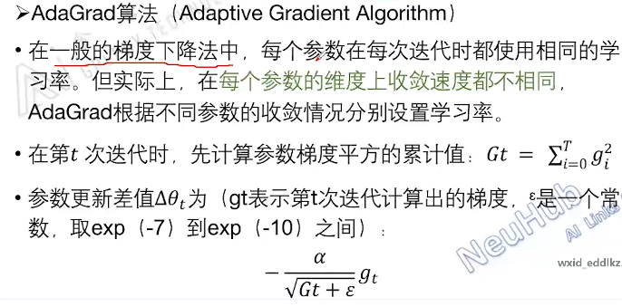

# 1. 机器学习评价指标

(1).准确率(Accuracy): 预测正确的结果占总样本的百分比, acc=(TP+TN)/(TP+TN+FP+FN)

(2).精确率(Precision): 在所有被预测为正的样本中实际为正的样本的概率, TP/(TP+FP)

(3).召回率(Recall): 在实际为正的样本中被预测为正样本的概率, TP/(TP+FN)

(4).[P-R曲线](https://blog.csdn.net/u013249853/article/details/96132766): 以Recall为横坐标, Precision为纵坐标, 随着阈值改变, 我们将得到P-R曲线。

(5).F1-Score: Precision和Recall的加权调和平均, F1=(2*P*R)/(P+R)

(6).[ROC](https://www.zhihu.com/question/39840928): 以真阳率(TPR=TP/TP+FN, TPRate的意义是所有真实类别为1的样本中, 预测类别为1的比例)为横坐标, 假阳率(FPR=FP/FP+TN, FPRate的意义是所有真实类别为0的样本中, 预测类别为1的比例)为纵坐标, 随着阈值改变, 我们将得到AUC曲线。

(7).AUC: ROC曲线下的面积, 最小值为0.5

(8).Macro- vs Micro-Averaging: Macro Average会首先针对每个类计算评估指标如Precesion, Recall, F1 Score, 然后对他们取平均得到Macro Precesion, Macro Recall, Macro F1。Micro Average则先计算总TP值, 总FP值等, 然后计算评估指标。

(9).ROUGE-N: 评估自动文摘以及机器翻译的指标, ROUGE-N主要统计N-gram上的召回率, 分母是N-gram的个数，分子是参考摘要和自动摘要共有的N-gram的个数。

# 2. 数据不平衡

在工程中，应对数据不平衡通常从以下三方面入手：

### 欠采样

- 原型生成(Prototype generation), 在原有基础上生成新的样本来实现样本均衡，具体做法如下：

1). 以少量样本总数出发，确定均衡后多量样本的总数

2). 多量样本出发，利用k-means算法随机计算K个多量样本的中心

3). 认为k-means的中心点可以代表该样本簇的特性，以该中心点代表该样本簇

4). 重复2,3步骤，生成新的多量样本集合

```
from sklearn.datasets import make_classification
from collections import Counter
X, y = make_classification(n_samples=5000, n_features=2, n_informative=2,
                           n_redundant=0, n_repeated=0, n_classes=3,
                           n_clusters_per_class=1,
                           weights=[0.01, 0.05, 0.94],
                           class_sep=0.8, random_state=0)
Counter(y)
Out[10]: Counter({0: 64, 1: 262, 2: 4674})

from imblearn.under_sampling import ClusterCentroids
 
cc = ClusterCentroids(random_state=0)
X_resampled, y_resampled = cc.fit_sample(X, y)
 
print sorted(Counter(y_resampled).items())
Out[32]:
[(0, 64), (1, 64), (2, 64)]
```

- 原型选择(Prototype selection), 从多数类样本中选取最具代表性的样本用于训练，主要是为了缓解随机欠采样中的信息丢失问题。 NearMiss 采用一些启发式的规则来选择样本, 根据规则的不同可分为 3 类, 通过设定 version 参数来确定：

NearMiss-1：选择到最近的 K 个少数类样本平均距离最近的多数类样本

NearMiss-2：选择到最远的 K 个少数类样本平均距离最近的多数类样本

NearMiss-3：对于每个少数类样本选择 K 个最近的多数类样本，目的是保证每个少数类样本都被多数类样本包围

### 过采样

- SMOTE, 通过从少量样本集合中筛选的样本 xi 和 xj 及对应的随机数 0<λ<1，通过两个样本间的关系来构造新的样本 xn = xi+λ(xj-xi), 即对于少数类样本a, 随机选择一个最近邻的样本b, 然后从a与b的连线上随机选取一个点c作为新的少数类样本。SMOTE算法的基本思想是对少数类样本进行分析并根据少数类样本人工合成新样本添加到数据集中，具体如下图所示，算法流程如下:


```
from imblearn.over_sampling import SMOTE
 
X_resampled_smote, y_resampled_smote = SMOTE().fit_sample(X, y)
 
sorted(Counter(y_resampled_smote).items())
Out[29]:
[(0, 4674), (1, 4674), (2, 4674)]
```

### 模型算法

- 通过引入有权重的模型算法(如sklearn的class_weight参数)，针对少量样本着重拟合，以提升对少量样本特征的学习。

### 采样代码示例

```
from collections import  Counter
import random

def find_idx(n, count):
    for i, k in enumerate(count):
        if n <= k:
            return i

def sample(a, k):
    wc = dict(Counter(a))
    words = [w for w, q in wc.items()]
    freqs = [q for w, q in wc.items()]
    result = []
    count = []
    total = sum(freqs)
    temp = 0
    for item in freqs:
        temp += item
        count.append(temp)
    while len(result) < k:
        n = random.randint(0, total)
        print (n)
        idx = find_idx(n, count)
        print (idx)
        print('------------')
        if words[idx] not in result:
            result.append(words[idx])
    return result

a=[1,1,1,1,1,2,2,3,3,3,3,6]            
print(sample(a,2))
```

### 文本数据增强

- 同义词替换

- 随机交换

- 随机删除

- 回译

# 3. 如何减小过拟合？

- 正则化(Regularization), 其主要目的是控制模型复杂度, L2正则化的效果是对原最优解的每个元素进行不同比例的放缩, L1正则化则会使原最优解的元素产生不同量的偏移, 并使某些元素为0, 从而产生稀疏性。
- 权重共享
- 增加更多数据
- Dropout, 即在每个训练批次中,以某种概率忽略一定数量的神经元, 使模型不会太依赖某些局部的特征, 减少神经元之间复杂的共适应关系, 迫使网络去学习更加鲁棒的特征, 可以明显地减少过拟合现象。
- Early stopping, 其基本含义是在训练中计算模型在验证集上的表现，当模型在验证集上的表现开始下降的时候，停止训练，这样就能避免继续训练导致过拟合的问题。

# 4. Batch Normalization vs Layer Normalization

Ref：https://github.com/jasoncao11/nlp-notebook/tree/master/QA


批归一化是不同数据之间对单个神经元的归一化，层归一化是单个训练数据对某一层所有神经元的归一化。


# 5. Sigmoid/ReLU/LeakyReLU/PReLU/ELU

Ref：https://zhuanlan.zhihu.com/p/172254089

# 6. 优化算法Optimizer比较





