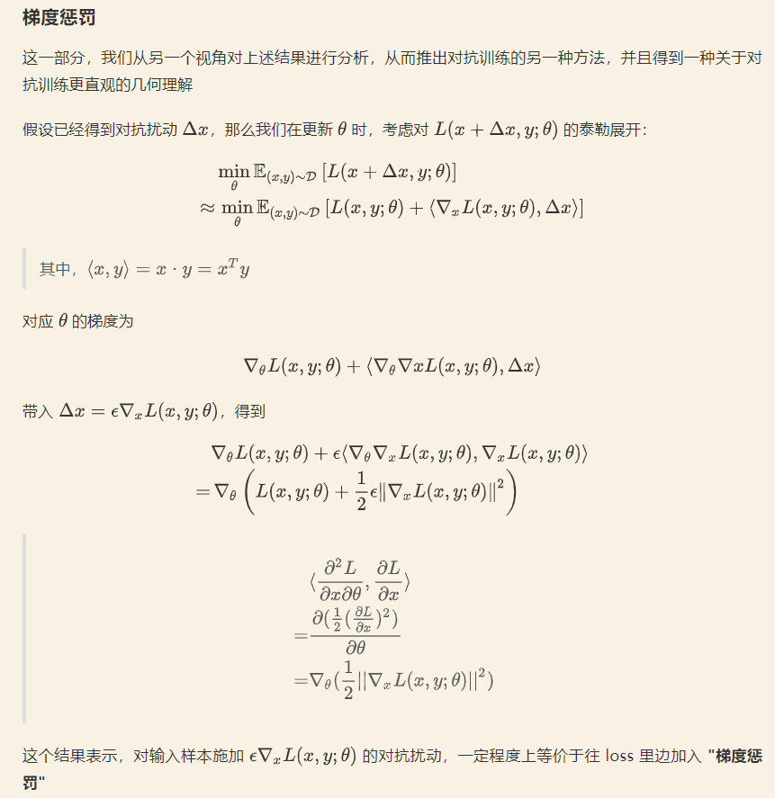

## 其他

### (1). 分类问题名称 & 输出层使用激活函数 & 对应的损失函数 & pytorch loss function
- 多标签 & sigmoid & binary cross entropy & BCELoss/BCEWithLogitsLoss
- 多分类 & softmax & categorical cross entropy & NLLLoss/CrossEntropyLoss
- 二分类可看作输出层有一个logit，对应sigmoid和binary cross entropy，或有两个logits，对应softmax和categorical cross entropy

### (2). 对抗训练 
- [NLP中的对抗训练 + PyTorch实现](https://zhuanlan.zhihu.com/p/91269728)

- 代码：
```
import torch
class FGM():
    def __init__(self, model):
        self.model = model
        self.backup = {}

    def attack(self, epsilon=1., emb_name='emb.'):
        # emb_name这个参数要换成你模型中embedding的参数名
        for name, param in self.model.named_parameters():
            if param.requires_grad and emb_name in name:
                self.backup[name] = param.data.clone()
                norm = torch.norm(param.grad)
                if norm != 0 and not torch.isnan(norm):
                    r_at = epsilon * param.grad / norm
                    param.data.add_(r_at)

    def restore(self, emb_name='emb.'):
        # emb_name这个参数要换成你模型中embedding的参数名
        for name, param in self.model.named_parameters():
            if param.requires_grad and emb_name in name: 
                assert name in self.backup
                param.data = self.backup[name]
        self.backup = {}
        
# 初始化
fgm = FGM(model)
for batch_input, batch_label in data:
    # 正常训练
    loss = model(batch_input, batch_label)
    loss.backward() # 反向传播，得到正常的grad
    # 对抗训练
    fgm.attack() # 在embedding上添加对抗扰动
    loss_adv = model(batch_input, batch_label)
    loss_adv.backward() # 反向传播，并在正常的grad基础上，累加对抗训练的梯度
    fgm.restore() # 恢复embedding参数
    # 梯度下降，更新参数
    optimizer.step()
    model.zero_grad()
```

### (3). 数据增强
- [华为开源的tinyBert数据增强方法](https://github.com/huawei-noah/Pretrained-Language-Model/blob/master/TinyBERT/data_augmentation.py#L146)

### (4). 标签平滑
- 标签平滑后的分布就相当于往真实分布中加入了噪声，避免模型对于正确标签过于自信，使得预测正负样本的输出值差别不那么大，从而避免过拟合，提高模型的泛化能力。但是在模型蒸馏中使用Label smoothing会导致性能下降。
- 代码：
```
import torch
import torch.nn as nn
def CrossEntropyLoss_label_smooth(outputs, targets, num_classes=3, epsilon=0.1):
    N = targets.size(0)
    # 初始化一个矩阵, 里面的值都是epsilon / (num_classes - 1)
    smoothed_labels = torch.full(size=(N, num_classes), fill_value=epsilon / (num_classes - 1))
    # 为矩阵中的每一行的某个index的位置赋值为1 - epsilon
    smoothed_labels = smoothed_labels.scatter_(dim=1, index=torch.unsqueeze(targets, dim=1), value=1 - epsilon)
    # 调用torch的log_softmax
    log_prob = nn.functional.log_softmax(outputs, dim=1)
    # 用之前得到的smoothed_labels来调整log_prob中每个值
    loss = - torch.sum(log_prob * smoothed_labels) / N
    return loss

if __name__ == '__main__':
    outputs = torch.tensor([[6,2,1],[9,8,7],[2,6,1]]).float()
    targets = torch.tensor([0,2,1]).long()
    print(CrossEntropyLoss_label_smooth(outputs, targets))
```

### (5). weight decay
- Demo：
```
# Prepare optimizer and schedule (linear warmup and decay)
no_decay = ['bias', 'LayerNorm.bias', 'LayerNorm.weight']
optimizer_grouped_parameters = [
    {'params': [p for n, p in model.named_parameters() if not any(nd in n for nd in no_decay)],
     'weight_decay': 0.01},
    {'params': [p for n, p in model.named_parameters() if any(nd in n for nd in no_decay)], 'weight_decay': 0.0}
]

total_steps = len(traindataloader) * N_EPOCHS
optimizer = AdamW(optimizer_grouped_parameters, lr=2e-5, eps=1e-8)
scheduler = get_linear_schedule_with_warmup(optimizer, num_warmup_steps=int(0.1 * total_steps), num_training_steps=total_steps)

model.train()
for epoch in range(N_EPOCHS):
    iter_bar = tqdm(traindataloader, desc="Iteration", disable=False)
    for step, batch in enumerate(iter_bar):
        input_ids = batch["input_ids"].to(device)
        token_type_ids = batch["token_type_ids"].to(device) 
        model.zero_grad()
        outputs = model(input_ids=input_ids, token_type_ids=token_type_ids)
        loss = outputs[0]
        loss.backward()
        #对抗训练
        torch.nn.utils.clip_grad_norm_(model.parameters(), 1.0)
        optimizer.step()
        scheduler.step()
```
