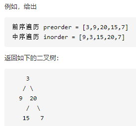
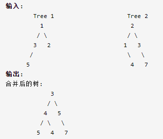

### 1.二叉树的中序遍历

给定一个二叉树的根节点 root ，返回它的 中序 遍历。

思路：栈，中序遍历：左，中，右，那么入栈顺序必须调整为倒序，也就是右，中，左

```
# Definition for a binary tree node.
# class TreeNode(object):
#     def __init__(self, val=0, left=None, right=None):
#         self.val = val
#         self.left = left
#         self.right = right
class Solution(object):
    def inorderTraversal(self, root):
        """
        :type root: TreeNode
        :rtype: List[int]
        """
        stack = [root]
        res = []
        while stack:
            i = stack.pop()
            if isinstance(i, TreeNode):
                stack.extend([i.right,i.val,i.left])
            elif isinstance(i, int):
                res.append(i)
        return res
```

### 2.验证二叉搜索树

给定一个二叉树，判断其是否是一个有效的二叉搜索树。

假设一个二叉搜索树具有如下特征：

节点的左子树只包含小于当前节点的数。
节点的右子树只包含大于当前节点的数。
所有左子树和右子树自身必须也是二叉搜索树。

思路：利用栈做中序遍历，得到递增的数列则为二叉搜索树

```
# Definition for a binary tree node.
# class TreeNode(object):
#     def __init__(self, val=0, left=None, right=None):
#         self.val = val
#         self.left = left
#         self.right = right
class Solution(object):
    def isValidBST(self, root):
        """
        :type root: TreeNode
        :rtype: bool
        """
        if not root:
            return False
        stack = [root]
        res = []

        while stack:
            i = stack.pop()
            if isinstance(i, TreeNode):
                stack.extend([i.right,i.val,i.left])
            if isinstance(i, int):
                if not res or (res and res[-1]<i):
                    res.append(i)
                else:
                    return False
        return True
```

### 3.二叉树的层序遍历

给你一个二叉树，请你返回其按 层序遍历 得到的节点值。 （即逐层地，从左到右访问所有节点）。

思路：队列 + BFS

```
# Definition for a binary tree node.
# class TreeNode(object):
#     def __init__(self, val=0, left=None, right=None):
#         self.val = val
#         self.left = left
#         self.right = right
class Solution(object):
    def levelOrder(self, root):
        """
        :type root: TreeNode
        :rtype: List[List[int]]
        """
        if not root:
            return []
            
        queue = [root]
        res = []

        while queue:
            n = len(queue)
            level = []
            for i in range(n):
                node = queue.pop(0)
                level.append(node.val)
                if node.left:
                    queue.append(node.left)
                if node.right:
                    queue.append(node.right)
            res.append(level)
        return res
```

### 4.对称二叉树

给定一个二叉树，检查它是否是镜像对称的。

```
class Solution(object):
	def isSymmetric(self, root):
		"""
		:type root: TreeNode
		:rtype: bool
		"""
		if not root or not (root.left or root.right):
			return True
		# 用队列保存节点	
		queue = [root.left,root.right]
		while queue:
		    # 从队列中取出两个节点，再比较这两个节点
		    left = queue.pop(0)
		    right = queue.pop(0)
		    # 如果两个节点都为空就继续循环，两者有一个为空就返回false
		    if not (left or right):
			continue
		    if not (left and right):
			return False
		    if left.val!=right.val:
			return False
		    # 将左节点的左孩子， 右节点的右孩子放入队列
		    queue.append(left.left)
		    queue.append(right.right)
		    # 将左节点的右孩子，右节点的左孩子放入队列
		    queue.append(left.right)
		    queue.append(right.left)
		return True
```

## 递归

### 1.什么样的问题可以用递归解决？

(1). 问题的解可以分解为几个子问题的解。何为子问题？就是数据规模更小的问题。 (2). 问题与子问题，除了数据规模不同，求解思路完全一样 (3). 存在递归终止条件

### 2.如何理解递归代码？

如果一个问题A可以分解为若干个子问题B、C、D，你可以假设子问题B、C、D已经解决。而且，你只需要思考问题A与子问题B、C、D两层之间的关系即可，不需要一层层往下思考子问题与子子问题，子子问题与子子子问题之间的关系。屏蔽掉递归细节，这样子理解起来就简单多了。
递归的一个非常重要的点就是：**不去管函数的内部细节是如何处理的，我们只看其函数作用以及输入与输出**。

### 1.二叉树的最大深度(递归)

二叉树的深度为根节点到最远叶子节点的最长路径上的节点数。

```
# Definition for a binary tree node.
# class TreeNode(object):
#     def __init__(self, val=0, left=None, right=None):
#         self.val = val
#         self.left = left
#         self.right = right
class Solution(object):
    def maxDepth(self, root):
        """
        :type root: TreeNode
        :rtype: int
        """
        if root is None: 
            return 0
			
	left_height = self.maxDepth(root.left) 
	right_height = self.maxDepth(root.right) 
	return max(left_height, right_height) + 1 
```

### 2.从前序与中序遍历序列构造二叉树(递归)

根据一棵树的前序遍历与中序遍历构造二叉树。




```
# Definition for a binary tree node.
# class TreeNode(object):
#     def __init__(self, val=0, left=None, right=None):
#         self.val = val
#         self.left = left
#         self.right = right
class Solution(object):
    def buildTree(self, preorder, inorder):
        """
        :type preorder: List[int]
        :type inorder: List[int]
        :rtype: TreeNode
        """
        if not (preorder and inorder):
	    return None
	# 根据前序数组的第一个元素，就可以确定根节点	
        root = TreeNode(preorder[0])
	# 用preorder[0]去中序数组中查找对应的元素
        mid_idx = inorder.index(preorder[0])
	# 递归的处理前序数组的左边部分和中序数组的左边部分
	# 递归处理前序数组右边部分和中序数组右边部分
        root.left = self.buildTree(preorder[1:mid_idx+1],inorder[:mid_idx])
        root.right = self.buildTree(preorder[mid_idx+1:],inorder[mid_idx+1:])
        return root
```

### 3.二叉树展开为链表(递归)

Ref：https://leetcode-cn.com/problems/flatten-binary-tree-to-linked-list/solution/114-er-cha-shu-zhan-kai-wei-lian-biao-by-ming-zhi-/


```
# Definition for a binary tree node.
# class TreeNode(object):
#     def __init__(self, val=0, left=None, right=None):
#         self.val = val
#         self.left = left
#         self.right = right
class Solution(object):
    def flatten(self, root):
        """
        :type root: TreeNode
        :rtype: None Do not return anything, modify root in-place instead.
        """

        if not root:
            return
        self.flatten(root.left)
        self.flatten(root.right)
        tmp = root.right
        root.right = root.left
        root.left = None
        while root.right:
            root = root.right
        root.right = tmp
```

### 4.合并二叉树(递归)



```
# Definition for a binary tree node.
# class TreeNode(object):
#     def __init__(self, val=0, left=None, right=None):
#         self.val = val
#         self.left = left
#         self.right = right
class Solution(object):
    def mergeTrees(self, root1, root2):
        """
        :type root1: TreeNode
        :type root2: TreeNode
        :rtype: TreeNode
        """
        if not root1:
            return root2

        if not root2:
            return root1

        merged = TreeNode(root1.val+root2.val)
        merged.left = self.mergeTrees(root1.left, root2.left)
        merged.right = self.mergeTrees(root1.right, root2.right)
        return merged 
```

