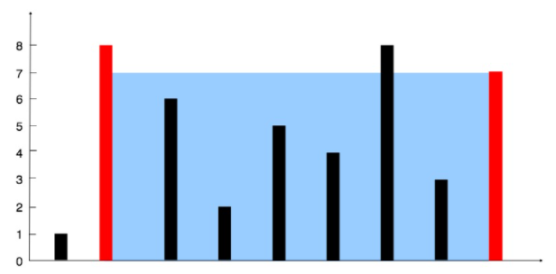

### 1.快速排序

快排的思想是这样的：如果要排序数组中下标从 p 到 r 之间的一组数据，我们选择 p 到 r 之间的任意一个数据作为 pivot（分区点）。我们遍历 p 到 r 之间的数据，将小于 pivot 的放到左边，将大于 pivot 的放到右边，将 pivot 放到中间。经过这一步骤之后，数组 p 到 r 之间的数据就被分成了三个部分，前面 p 到 q-1 之间都是小于 pivot 的，中间是 pivot，后面的 q+1 到 r 之间是大于 pivot 的。根据分治、递归的处理思想，我们可以用递归排序下标从 p 到 q-1 之间的数据和下标从 q+1 到 r 之间的数据，直到区间缩小为 1，就说明所有的数据都有序了。


时间复杂度：O(nlogn)

```
循环不变量 [0,i) 之间元素<pivot, [i,j] 之间元素>=pivot

def partition(nums, left, right):   
    pivot = nums[right]
    i = left
    for j in range(left, right+1):
        if nums[j] < pivot:
            nums[i], nums[j] = nums[j], nums[i]
            i += 1
    nums[i], nums[j] = nums[j], nums[i]
    return i

def quick_sort(nums, left, right):
    if left >= right:
        return
    q = partition(nums, left, right)
    quick_sort(nums, left, q-1)
    quick_sort(nums, q+1, right)
    return nums
    
print(quick_sort([2,5,3,6,6,6], 0, 5))
```
### 变种(数组中的第K个最大元素)
在未排序的数组中找到第 k 个最大的元素。请注意，你需要找的是数组排序后的第 k 个最大的元素，而不是第 k 个不同的元素。

```
class Solution(object):

    def partition(self, nums, left, right):
        i = left
        pivot = nums[right]
        for j in range(left, right+1):
            if nums[j] < pivot:
                nums[i],nums[j] = nums[j],nums[i]
                i += 1
        nums[i],nums[j] = nums[j],nums[i]
        return i

    def findKthLargest(self, nums, k):
        """
        :type nums: List[int]
        :type k: int
        :rtype: int
        """

        n = len(nums)
        left = 0
        right = n-1
        target = n-k

        while True:
            index = self.partition(nums, left, right)
            if index == target:
                return nums[index]
            elif index < target:
                left = index+1
            else:
                right = index-1
```

### 2.移动零

给定一个数组 nums，编写一个函数将所有 0 移动到数组的末尾，同时保持非零元素的相对顺序。即输入: [0,1,0,3,12]  输出: [1,3,12,0,0]

思路：循环不变量 [0,i) 之间元素全不为0, [i,j] 之间元素全为0

```
class Solution(object):
    def moveZeroes(self, nums):
        """
        :type nums: List[int]
        :rtype: None Do not return anything, modify nums in-place instead.
        """

        n = len(nums)
        i = 0
        for j in range(n):
            if nums[j]:
                nums[i], nums[j] = nums[j], nums[i]
                i += 1
        return nums
```

### 3.删除有序数组中的重复项

一个有序数组 nums ，原地删除重复出现的元素，使每个元素只出现一次 ，返回删除后数组的新长度。

思路：循环不变量 [0,i] 之间包含所有已知的不重复元素

```
class Solution(object):
    def removeDuplicates(self, nums):
        """
        :type nums: List[int]
        :rtype: int
        """
        if not nums:
            return 0
        n = len(nums)
        i = 0

        for j in range(n):
            if nums[i] != nums[j]:
                nums[i+1],nums[j] = nums[j],nums[i+1]
                i += 1
        return i+1
``` 

### 4.颜色分类

给定一个包含红色、白色和蓝色，一共 n 个元素的数组，原地对它们进行排序，使得相同颜色的元素相邻，并按照红色、白色、蓝色顺序排列。

输入：nums = [2,0,2,1,1,0]
输出：[0,0,1,1,2,2]

思路：循环不变量 all in [0, p0) = 0， all in [p0, p1) = 1，all in [p1, i] = 2
```
class Solution(object):
    def sortColors(self, nums):
        """
        :type nums: List[int]
        :rtype: None Do not return anything, modify nums in-place instead.
        """
        # all in [0, p0) = 0
        # all in [p0, p1) = 1
        # all in [p1, i] = 2

        n = len(nums)
        p0 = p1 = 0
        for i in range(n):
            if nums[i] == 1:
                nums[i], nums[p1] = nums[p1], nums[i]
                p1 += 1
            elif nums[i] == 0:
                nums[i], nums[p0] = nums[p0], nums[i]
                if p0 < p1:
                    nums[i], nums[p1] = nums[p1], nums[i]
                p0 += 1
                p1 += 1
```

### 5.盛最多水的容器

给你 n 个非负整数 a1，a2，...，an，每个数代表坐标中的一个点 (i, ai) 。在坐标内画 n 条垂直线，垂直线 i 的两个端点分别为 (i, ai) 和 (i, 0) 。找出其中的两条线，使得它们与 x 轴共同构成的容器可以容纳最多的水。



输入：[1,8,6,2,5,4,8,3,7]

输出：49 

解释：图中垂直线代表输入数组 [1,8,6,2,5,4,8,3,7]。在此情况下，容器能够容纳水（表示为蓝色部分）的最大值为 49。

思路：设置双指针 i,j 分别位于容器壁两端，根据规则移动指针更新面积最大值，直到 i == j

```
class Solution(object):
    def maxArea(self, height):
        """
        :type height: List[int]
        :rtype: int
        """

        i = 0
        j = len(height)-1
        max_area = 0
        while i < j:
            if height[i] < height[j]:
                max_area = max(max_area, height[i]*(j-i))
                i += 1
            else:
                max_area = max(max_area, height[j]*(j-i))
                j -= 1
        return max_area
```

### 6.最短无序连续子数组

一个整数数组 nums ，找出一个 连续子数组 ，如果对这个子数组进行升序排序，那么整个数组都会变为升序排序。请找出符合题意的最短子数组，并输出它的长度。

思路：双指针分别从两端遍历两数组找第一次不同的位置

```
class Solution(object):
    def findUnsortedSubarray(self, nums):
        """
        :type nums: List[int]
        :rtype: int
        """
        n = len(nums)
        snums = sorted(nums)
        left = right = 0

        for i in range(n):
            if snums[i] != nums[i]:
                left = i
                break
        
        for j in range(n-1,-1,-1):
            if snums[j] != nums[j]:
                right = j
                break

        if right-left > 0:
            return right-left+1
        else:
            return 0
```
