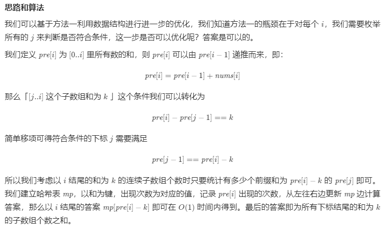

### 1.合并区间

输入：intervals = [[1,3],[2,6],[8,10],[15,18]]
输出：[[1,6],[8,10],[15,18]]
解释：区间 [1,3] 和 [2,6] 重叠, 将它们合并为 [1,6].

思路：将列表中的区间按照左端点升序排序。然后将第一个区间加入 merged 数组中，并按顺序依次考虑之后的每个区间：

(1). 如果当前区间的左端点在数组中最后一个区间的右端点之后，那么它们不会重合，直接将这个区间加入数组 merged 的末尾；

(2). 否则，它们重合，我们需要用当前区间的右端点更新数组 merged 中最后一个区间的右端点，将其置为二者的较大值。

```
class Solution(object):
    def merge(self, intervals):
        """
        :type intervals: List[List[int]]
        :rtype: List[List[int]]
        """
        intervals.sort(key=lambda x:x[0])

        merged = []
        for interval in intervals:
            if not merged or interval[0] > merged[-1][1]:
                merged.append(interval)
            else:
                merged[-1][1] = max(merged[-1][1], interval[1])
        return merged
```

### 2.旋转图像

给定一个 n × n 的二维矩阵 matrix 表示一个图像。请你将图像顺时针旋转 90 度。


```
class Solution(object):
    def rotate(self, matrix):
        """
        :type matrix: List[List[int]]
        :rtype: None Do not return anything, modify matrix in-place instead.
        """

        #水平翻转
        n = len(matrix)
        for i in range(n//2):
            matrix[i],matrix[n-i-1] = matrix[n-i-1],matrix[i]
        #对角线翻转
        for i in range(n):
            for j in range(i):
                matrix[i][j], matrix[j][i] = matrix[j][i], matrix[i][j]
        #return matrix
```

### 3.和为K的子数组(前缀和)

给定一个整数数组和一个整数 k，你需要找到该数组中和为 k 的连续的子数组的个数。

输入:nums = [1,1,1], k = 2
输出: 2 , [1,1] 与 [1,1] 为两种不同的情况。

Ref: https://leetcode-cn.com/problems/subarray-sum-equals-k/solution/he-wei-kde-zi-shu-zu-by-leetcode-solution/



```
class Solution(object):
    def subarraySum(self, nums, k):
        """
        :type nums: List[int]
        :type k: int
        :rtype: int
        """

        dic = {0:1}
        presum = 0
        count = 0
        for i in nums:
            presum += i
            count += dic.get(presum-k, 0)

            if presum in dic:
                dic[presum] += 1
            else:
                dic[presum] = 1
        return count
```

### 4.比特位计数

给定一个非负整数 num。对于 0 ≤ i ≤ num 范围中的每个数字 i ，计算其二进制数中的 1 的数目并将它们作为数组返回。

输入: 2
输出: [0,1,1]


Ref: https://leetcode-cn.com/problems/counting-bits/solution/hen-qing-xi-de-si-lu-by-duadua/

```
class Solution(object):
    def countBits(self, num):
        """
        :type num: int
        :rtype: List[int]
        """
        res = [0]*(num+1)

        for i in range(1,num+1):
            if i&1:
                res[i] = res[i-1]+1
            else:
                res[i] = res[i/2]
        return res
```

### 5.除自身以外数组的乘积(前缀积/后缀积)

给你一个长度为 n 的整数数组 nums，其中 n > 1，返回输出数组 output ，其中 output[i] 等于 nums 中除 nums[i] 之外其余各元素的乘积。

输入: [1,2,3,4]
输出: [24,12,8,6]


Ref：https://leetcode-cn.com/problems/product-of-array-except-self/solution/gan-jue-da-bu-fen-ti-jie-du-shi-tie-dai-ma-jia-fu-/

```
class Solution(object):
    def productExceptSelf(self, nums):
        """
        :type nums: List[int]
        :rtype: List[int]
        """

        n = len(nums)
        left = [1]*n
        for i in range(1, n):
            left[i] = left[i-1]*nums[i-1]

        res = 1
        for i in range(n-1, -1, -1):
            left[i] *= res
            res *= nums[i]
        return left
```

### 6.最长连续序列(利用哈希表)

给定一个未排序的整数数组 nums ，找出数字连续的最长序列（不要求序列元素在原数组中连续）的长度。设计并实现时间复杂度为 O(n) 的解决方案

输入：nums = [100,4,200,1,3,2]
输出：4
解释：最长数字连续序列是 [1, 2, 3, 4]。它的长度为 4。

Ref：https://leetcode-cn.com/problems/longest-consecutive-sequence/solution/zui-chang-lian-xu-xu-lie-by-leetcode-solution/

```
class Solution(object):
    def longestConsecutive(self, nums):
        """
        :type nums: List[int]
        :rtype: int
        """

        longest_len = 0
        
        nums = set(nums)
        for num in nums:
            if num-1 not in nums:
                cur_num = num
                cur_len = 1
                while cur_num+1 in nums:
                    cur_len += 1
                    cur_num += 1
                longest_len = max(longest_len, cur_len)
                    
        return longest_len
```