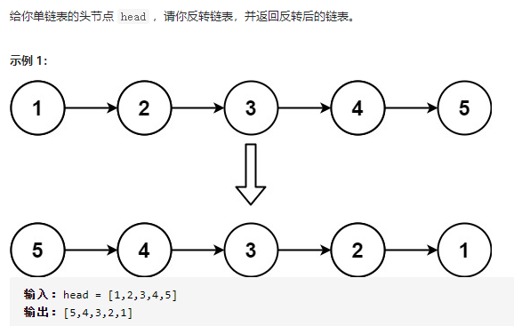
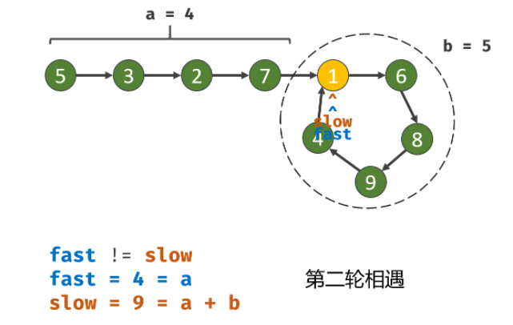
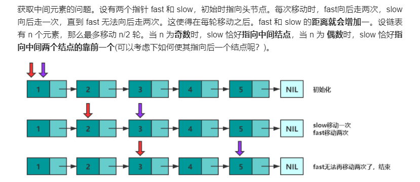
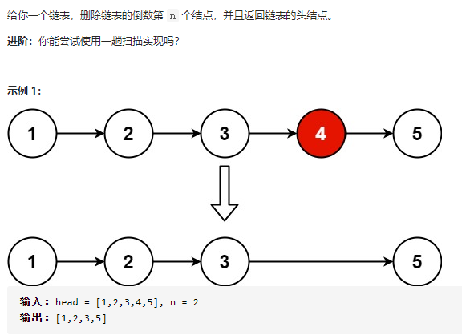
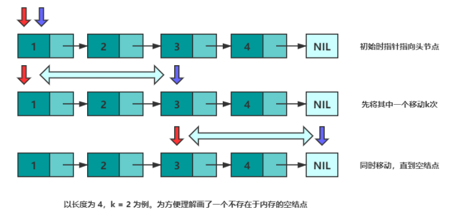
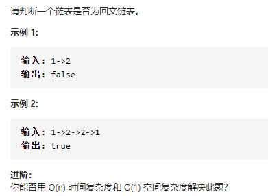

### 1.合并两个有序链表(递归)


```
class Solution:
    def mergeTwoLists(self, l1: ListNode, l2: ListNode) -> ListNode:
        if not l1: return l2  # 终止条件，直到两个链表都空
        if not l2: return l1
        if l1.val <= l2.val:  # 递归调用
            l1.next = self.mergeTwoLists(l1.next,l2)
            return l1
        else:
            l2.next = self.mergeTwoLists(l1,l2.next)
            return l2
```

### 2.反转链表(递归)



```
# Definition for singly-linked list.
# class ListNode(object):
#     def __init__(self, val=0, next=None):
#         self.val = val
#         self.next = next
class Solution(object):
    def reverseList(self, head):
        """
        :type head: ListNode
        :rtype: ListNode
        """

        if not(head and head.next):
            return head

        cur = self.reverseList(head.next)

        head.next.next = head
        head.next = None

        return cur
```

### 2-1.反转链表(双指针)

```
class Solution(object):
	def reverseList(self, head):
		"""
		:type head: ListNode
		:rtype: ListNode
		"""
		# 申请两个节点，pre和 cur，pre指向None
		pre = None
		cur = head
		# 遍历链表，while循环里面的内容其实可以写成一行
		while cur:
			# 记录当前节点的下一个节点
			tmp = cur.next
			# 然后将当前节点指向pre
			cur.next = pre
			# pre和cur节点都前进一位
			pre = cur
			cur = tmp
		return pre
```

### 3.环形链表(双指针)


设有两个指针 fast 和 slow，初始时指向头节点。每次移动时，fast向后走两次，slow向后走一次，直到 fast 无法向后走两次。当一个链表有环时，快慢指针都会陷入环中进行无限次移动，然后变成了追及问题。想象一下在操场跑步的场景，只要一直跑下去，快的总会追上慢的。当两个指针都进入环后，每轮移动使得慢指针到快指针的距离增加一，同时快指针到慢指针的距离也减少一，只要一直移动下去，快指针总会追上慢指针。

Ref：https://leetcode-cn.com/problems/linked-list-cycle/solution/yi-wen-gao-ding-chang-jian-de-lian-biao-wen-ti-h-2/

```
class Solution(object):
    def hasCycle(self, head):
        """
        :type head: ListNode
        :rtype: bool
        """

        slow = fast = head
        while fast and fast.next:
            slow = slow.next
            fast = fast.next.next
            if slow == fast:
                return True
        return False
```

### 3-1.环形链表(双指针)

给定一个链表，返回链表开始入环的第一个节点。如果链表无环，则返回 null。

Ref：https://leetcode-cn.com/problems/linked-list-cycle-ii/




```
# Definition for singly-linked list.
# class ListNode(object):
#     def __init__(self, x):
#         self.val = x
#         self.next = None

class Solution(object):
    def detectCycle(self, head):
        """
        :type head: ListNode
        :rtype: ListNode
        """
        flag = False
        fast, slow = head, head
        while fast and fast.next:        
            fast, slow = fast.next.next, slow.next
            if fast == slow: 
                flag = True
                break
        if not flag:
            return

        fast = head
        while fast != slow:
            fast, slow = fast.next, slow.next
        return fast
```

### 4.链表的中间结点(双指针)



```
# Definition for singly-linked list.
# class ListNode(object):
#     def __init__(self, x):
#         self.val = x
#         self.next = None

class Solution(object):
    def middleNode(self, head):
        """
        :type head: ListNode
        :rtype: ListNode
        """

        slow = fast = head
        while fast and fast.next:
            fast = fast.next.next
            slow = slow.next
        return slow
``` 

### 5.删除链表的倒数第 N 个结点(双指针)





```
# Definition for singly-linked list.
# class ListNode(object):
#     def __init__(self, val=0, next=None):
#         self.val = val
#         self.next = next
class Solution(object):
    def removeNthFromEnd(self, head, n):
        """
        :type head: ListNode
        :type n: int
        :rtype: ListNode
        """      
        slow = head
        fast = head

        for i in range(n):
            fast = fast.next
        
        if not fast:
            return head.next;

        while fast.next:
            slow = slow.next
            fast = fast.next
        slow.next = slow.next.next
        return head
```

### 6.回文链表(双指针用于反转+找中间点)



```
# Definition for singly-linked list.
# class ListNode(object):
#     def __init__(self, val=0, next=None):
#         self.val = val
#         self.next = next
class Solution(object):
    def isPalindrome(self, head):
        """
        :type head: ListNode
        :rtype: bool
        """

        if not head:
            return False
        if not head.next:
            return True

        # 用于找到中间点的指针
        slow = head
        fast = head
        # 用于反转的指针
        pre = None
        cur = head

        while fast and fast.next:
            slow = slow.next
            fast = fast.next.next
            cur.next = pre
            pre = cur
            cur = slow

        #奇数情况
        if fast:
            slow = slow.next

        while pre and slow:
            if pre.val != slow.val:
                return False
            pre = pre.next
            slow = slow.next
        return True
```

### 7.相交链表


Ref：https://leetcode-cn.com/problems/intersection-of-two-linked-lists/solution/tu-jie-xiang-jiao-lian-biao-by-user7208t/

可以理解成两个人速度一致，走过的路程一致，那么肯定会同一个时间点到达终点。如果到达终点的最后一段路两人都走的话，那么这段路上俩人肯定是肩并肩手牵手的。

```
# Definition for singly-linked list.
# class ListNode(object):
#     def __init__(self, x):
#         self.val = x
#         self.next = None

class Solution(object):
    def getIntersectionNode(self, headA, headB):
        """
        :type head1, head1: ListNode
        :rtype: ListNode
        """

        if not(headA and headB):
            return None

        pA = headA
        pB = headB

        while pA != pB:
            pA = pA.next if pA else headB
            pB = pB.next if pB else headA
        return pA
```